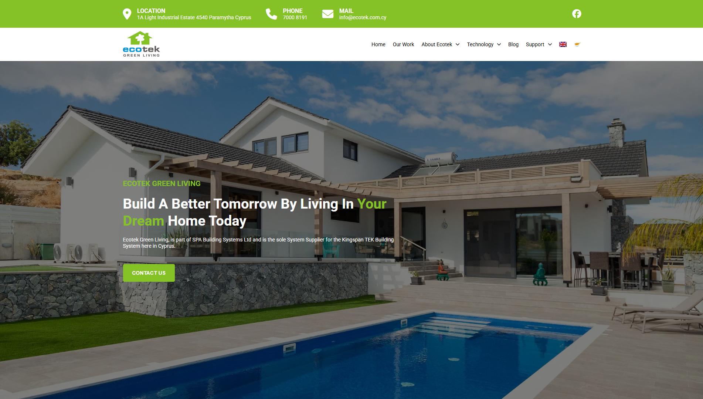

# 🌿 Ecotek Website Clone

---

## 📸 Preview

> Add a screenshot of your project and save it as `screenshot.png` in the root folder.

---

## 🛠️ Tech Stack

- **HTML5** – Markup structure  
- **CSS3** – Styling and layout  
- **JavaScript (Vanilla)** – DOM interaction and logic  
- **GSAP** – Smooth animations and scroll-based effects  

---

## ✨ Features

- Responsive design (mobile, tablet, desktop)  
- Scroll-triggered animations with GSAP  
- Smooth entrance effects and transitions  
- Fully animated sections  
- Clean and organized codebase  

---

## 📁 Project Structure

